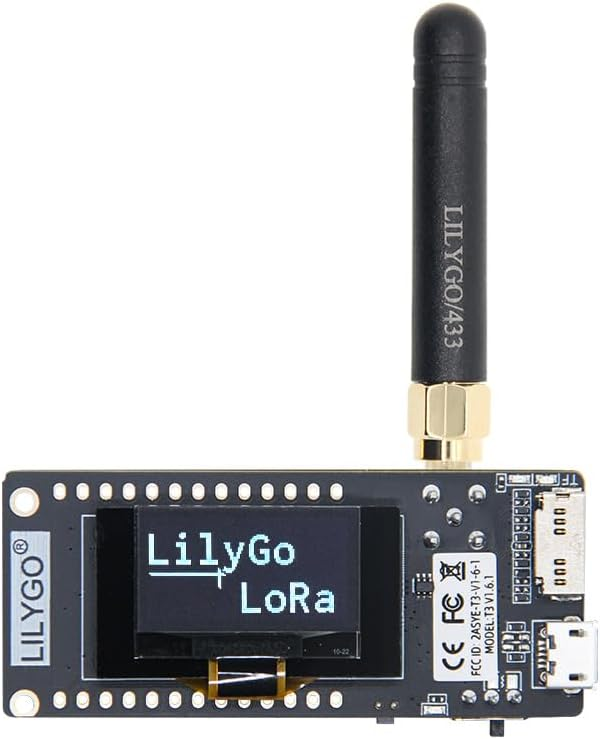
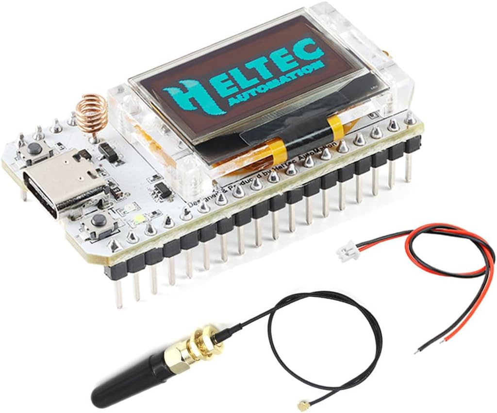

# esphome-quietcool

ESPHome firmware that controls **QuietCool whole-house / gable attic fans** over
their native 433.92 MHz radio link, from Home Assistant — no cloud, no OEM hub,
no BLE. The RF protocol was **reverse-engineered from the OEM handheld remote's
firmware** (an STM32 dump + SDR captures); this repository is an independent,
clean-room implementation of what that analysis found.

> QuietCool's wireless wall/handheld controls speak a proprietary 2-FSK protocol
> that ordinary 433 MHz gear (Sonoff RF Bridge, OOK/ASK bridges) can't reproduce.
> This project drives the fan directly with a Semtech LoRa transceiver in raw FSK
> packet mode.

## Where to buy

All you need is one of these two off-the-shelf ESP32 LoRa boards (each is a
complete kit: ESP32 + 433 MHz radio + OLED + antenna):

| [LilyGO TTGO LoRa32 V2.1 (433 MHz)](https://amzn.to/4vBvqOU) | [HiLetgo ESP32 LoRa V3 (SX1262)](https://amzn.to/4wagWqi) |
| :---: | :---: |
| [](https://amzn.to/4vBvqOU) | [](https://amzn.to/4wagWqi) |
| **[Buy on Amazon](https://amzn.to/4vBvqOU)** — the reference board this project was built and **verified working on real fans** (SX1278, `quietcool-lora32.yaml`) | **[Buy on Amazon](https://amzn.to/4wagWqi)** — ⚠️ **not yet confirmed working**: the SX1262/ESP32-S3 port (`quietcool-lora-v3.yaml`) compiles but hasn't been tested on real hardware. Choose the LilyGO unless you want to help with bring-up |

<sub>Disclosure: as an Amazon Associate (store `joyfulhousegi-20`) the maintainers
may earn from qualifying purchases through the links above. They cost you nothing
extra.</sub>

## Features

- **Closed-loop confirmation** — after a new command the controller sends the
  OEM's own `66 66` status query, decodes the fan's reply, and confirms that
  the query-correlated reported state matches the request. The custom fan
  control path does not publish a request
  as observed state. Because ESPHome's native Fan API cannot represent
  “unknown” and exposes its raw Off/Low defaults when HA first subscribes,
  `Fan State Known` records whether that entity state is physical evidence;
  the atomic `Fan Confirmed Off` diagnostic is the recommended HA interlock
  input. Every equivalent request joins its active transaction without
  transmitting again or resetting its fixed, spaced attempt budget.
- **Direct RF fan control** — Off / Low / Medium / High (where supported by
  the fan model) on the fan entity, plus a speed-aware timer select covering
  the fan's full 1 / 2 / 4 / 8 / 12-hour range — more than the OEM remote's
  three timer buttons expose — transmitted as the exact OEM frames. `Timer
  State Known` gates the select and countdown: they are not initialized to a
  guessed `None`, and an unresolved command cannot present stale timer metadata
  as confirmed.
- **Learn mode** — capture your fan's 4-byte sender ID by pressing its OEM remote
  twice. No packet sniffing or firmware extraction needed to onboard; the ID is
  persisted in NVS and survives reboots and OTA. See
  [Learn mode](#learn-mode--porting-to-your-own-fan).
- **Home Assistant native API** — a proper `fan` entity plus diagnostics
  (TX/RX counters, last command, learned sender ID, battery voltage/level).
- **Bi-directional diagnostics, query-confirmed state** — the controller also
  *listens* and records strictly validated OEM traffic without echoing it over
  RF. A passively heard OEM command cancels conflicting local work and is
  visible in RF diagnostics, but it never mutates the safety-facing fan entity:
  hearing a command is not proof that the receiver acted. Only consensus from
  this controller's locally anchored query can publish physical state.
- **On-device OLED** — animated fan icon, HH:MM:SS timer countdown, three
  HA-relayed temperatures (indoor / outdoor / attic) with semantic icons, and a
  WiFi / API / battery status row. Temperature sources are configurable from the
  HA UI, not hard-coded.
- **Safety-first** — never transmits at boot, after OTA, on API reconnect, from
  restored state, or from a received frame. Multi-model adversarially reviewed.
- **Multi-board & multi-fan** — one shared config, thin per-device wrappers.

### How the closed loop works

The fan answers the OEM `66 66` status query with a six-byte state report
(`CB` + your remote's ID suffix + a duplicated state byte). This firmware uses
the exact validation rules recovered from the OEM remote's STM32: state is
compared on the lower six bits, any zero-duration report confirms Off
regardless of remembered speed, and bits 7:6 carry the fan's speed-capability
metadata. After each command burst the controller queries, requires **response
consensus** (repeated agreeing reports inside a bounded listen window — with a
deliberately narrow recovery tier for weak-link bit errors, since the fan has
no CRC), and then either confirms and stops, or lets the pre-existing spaced
re-fire backstop continue up to its fixed attempt budget. Every outcome —
`confirmed`, `mismatch`, `no consensus`, `FAILED`, or `superseded by OEM
remote` — is published to Home Assistant, and a physical OEM remote press
always takes priority over pending automatic work. Hearing its `66 66` query
reserves a two-second exchange holdoff in which no local query or state frame
can take airtime. The response decoder and single-transaction flow, including
the 2026-07-19 state-knowledge/coalescing correction, were validated live on a
downstream SX1278 installation. The capability diagnostics identified the test
fan as a two-speed model, and three rapid equivalent Off calls joined one
transaction that confirmed after one command and one query. Full detail is in
[docs/protocol.md](docs/protocol.md) and
[docs/firmware-analysis.md](docs/firmware-analysis.md).

All duration-zero commands (`80`, `90`, `A0`, and `B0`) are semantically Off.
The transmitter may preserve the fan's remembered-speed nibble as an
OEM-faithful compatibility policy, but a duplicate active Off request joins the
same transaction regardless of that nibble. Command requests never publish the
fan entity optimistically. Correlated local-query consensus may set `Fan State
Known`; passive OEM traffic is diagnostics-only and clears/leaves state
authority false. `Fan Confirmed Off` is the atomic safety signal: it is true
only when authoritative consensus says Off, and false for running or unknown
state. This avoids an HA batching race that can occur when a safety automation
separately joins the fan entity and a Known flag.

The same rule applies to timers. Boot leaves the timer select without a guessed
selection. Every new command, and every actual non-query command burst including
an automatic re-fire, invalidates both `Fan State Known` and `Timer State Known`.
Outgoing commands do not optimistically arm or clear confirmed timer metadata.
The fan reports the programmed duration, not when the timer began, so a trusted
countdown is created only when a locally initiated timer command is confirmed;
an active-timer report from a manual Refresh has unknown age and remains
diagnostic-only. When an estimated local countdown reaches zero, the firmware
invalidates state and timer authority instead of publishing a guessed Off.

The serialized TX queue is deliberately finite (`max_runs: 5`). ESPHome may
reject an execution beyond that capacity, so this project does not promise one
on-air burst for every rapid press. A new transaction and its re-fire command
are armed before enqueue, and the spaced driver waits for TX to become idle;
that gives the latest desired command a bounded retry path even when its initial
enqueue was rejected. At actual execution, obsolete queued state commands are
discarded before airtime. A following query is scheduled so its 300 ms
acceptance floor begins one millisecond after the preceding inclusive 2.5 s
response tail; the original one-second spaced command re-fire remains eligible
while that query is pending.

### 2026-07-19 production Off-flapping RCA

Production recorder and controller diagnostics captured 107 Home Assistant fan
state transitions in 73.34 seconds after a window interlock requested Off: 54
interlock runs, 53 RF-confirmation mismatches that all still showed five attempts
remaining, and 118 RF bursts (354 application frames). The fan repeatedly
reported `B1` (High, one-hour timer); no ESP-originated On command was present.

The observed feedback path was the former ESPHome `TemplateFan` publishing optimistic
Off, followed by Home Assistant re-entering the interlock when confirmation
restored On. Each re-entry started a fresh Off transaction and reset the
nominally bounded attempt counter. The correction has independent guards:

1. never publish locally requested or passive OEM state into the safety fan
   entity; and
2. coalesce every semantically equivalent request into its active transaction
   without TX, counter reset, or loss of query/consensus evidence;
3. discard stale different-command queue entries before airtime; and
4. poison superseded query epochs and conflicting response mailboxes so stale
   consensus cannot restore authority.

The one-second spaced re-fire mechanism and its terminal attempt limit remain
unchanged. These records demonstrate reported-state flapping and excessive RF
traffic; without an independent motor sensor they do not prove that the
physical fan cycled 53 times. They also do not prove that speed-matched Off is
required: `90` later succeeded while the last apparent state was High.

On 2026-07-19 the corrected logic was OTA-flashed exactly once to the downstream
SX1278 controller and exercised without energizing the already-Off fan. A
62-second post-boot observation produced zero transmissions and left all state
authority unknown. Manual Refresh then received two exact `90 90` reports, and
three rapid HA Off calls produced only one Off burst plus one query; the two
duplicate calls joined the active budget, and the transaction confirmed `90`
after one command and one query. Home Assistant recorded no fan or interlock
state transitions during the test. This is RF confirmation, not independent
airflow or motor proof. The public SX1278 source was compiled but its named
artifact was not the file flashed; the SX1262/V3 image was compiled and remains
unverified on hardware.

## Supported hardware

| Board | Radio | MCU | Config | Status |
| --- | --- | --- | --- | --- |
| LilyGO TTGO LoRa32 **V2.1** (433 MHz) | SX1278 (SX127x) | ESP32 | `quietcool-lora32.yaml` | Verified on real fans |
| Heltec / HiLetgo ESP32 LoRa **V3** (433–510 MHz) | SX1262 (SX126x) | ESP32-S3 | `quietcool-lora-v3.yaml` | Builds; awaiting hardware bring-up |

The V3 port reproduces the identical 2-FSK profile on the SX1262 (ESPHome's
`sx126x` component exposes the same bitrate/deviation/sync/preamble/variable-length
knobs). CI validates and compiles both checked-in targets. The V3 has not been
run on real hardware yet — a few pins
(status-LED polarity, the VBAT ADC divider, and the RX filter bandwidth) are
noted inline as `PIN CONFIDENCE` items to confirm on first bring-up. See
[docs/hardware.md](docs/hardware.md).

Both need a **433 MHz antenna** connected before transmitting.

Buying links (with product photos) are at the top of this README under
[Where to buy](#where-to-buy).

## Quick start

```bash
# 1. Install ESPHome (uv recommended)
uv venv .venv && uv pip install --python .venv/bin/python esphome

# 2. Provide secrets
cp secrets.yaml.example secrets.yaml   # then edit

# 3. Validate, build, flash (USB first time, OTA after)
.venv/bin/esphome run quietcool-lora32.yaml
```

Then adopt the device in Home Assistant (ESPHome integration) and teach it your
fan via [Learn mode](#learn-mode--porting-to-your-own-fan). The full
step-by-step walkthrough — flashing, HA adoption, pairing, display setup,
troubleshooting — is in **[INSTALL.md](INSTALL.md)**.

## Documentation

- [INSTALL.md](INSTALL.md) — step-by-step install, pairing, and troubleshooting
- [docs/protocol.md](docs/protocol.md) — RF profile, frame format, command byte
- [docs/firmware-analysis.md](docs/firmware-analysis.md) — the reverse-engineering:
  memory map, register config, command-byte and response-parser disassembly,
  per-unit ID mechanism
- [docs/hardware.md](docs/hardware.md) — boards, wiring, antenna, buying links
- [docs/display.md](docs/display.md) — OLED layout, icon language, preview renderer
- [docs/deployment.md](docs/deployment.md) — multi-device pattern + a real 2-fan install

## Repository layout

```
INSTALL.md                       # step-by-step setup guide
quietcool-lora32.yaml            # TTGO LoRa32 V2.1 / SX1278 — shared base config
quietcool-lora-v3.yaml           # Heltec/HiLetgo ESP32-S3 / SX1262 port
components/quietcool_confirmed_fan/ # confirmation-driven fan entity platform
secrets.yaml.example             # copy to secrets.yaml (gitignored)
tests/                           # config regression tests (pytest/unittest)
tools/                           # display renderer + fan-frame generator
fonts/ images/                   # OLED assets (MDI webfont, fan bitmaps)
docs/                            # protocol, firmware analysis, hardware, display
```

## Safety

A whole-house fan moves a lot of air. Before energizing one: open enough windows
for makeup air, confirm combustion appliances can't backdraft, and keep a working
OEM control as a fallback. The checked-in templates preserve a strict causal
invariant: RF only ever originates from an explicit button press or Home
Assistant command, plus the bounded follow-ups those arm — the confirmation
query and the spaced re-fire attempts, both volatile and hard-limited. Nothing
transmits at boot, after OTA, on reconnect, from restored state, or from a
received frame. Repeated equivalent Off requests are transaction-idempotent:
they cannot transmit, replenish attempts, clear confirmation evidence, or
extend the terminal deadline. A heard OEM-remote press cancels all pending
automatic work.

Home Assistant safety automations should use the single `Fan Confirmed Off`
binary sensor when they need an Off assertion. On initial API subscription the
native fan entity necessarily exposes the Fan API's raw Off/Low defaults even
though no RF observation exists; joining that entity with `Fan State Known` in
HA is not atomic. `Fan State Known` remains useful as a diagnostic authority
flag for the fan entity, and timer consumers must require `Timer State Known`.
None of these RF-derived values is an eternal physical sensor: if every frame
from a later OEM press is missed, the last confirmation can become stale. Use
an explicit Refresh or a separate motor/airflow sensor where freshness is
safety-critical.


## Learn mode / porting to your own fan

Every QuietCool OEM sender ID is four bytes beginning with `CB`; the RF
profile and command format are universal. This firmware can therefore learn a
fan's ID from its OEM remote through the existing receive path.

### First-boot flow for another fan

1. Before compiling, change the top-level substitution in
   `quietcool-lora32.yaml` to:

   ```yaml
   substitutions:
     quietcool_sender_id: "0x00000000"
   ```

   This is deliberately a normal substitution, not a `!secret`, so the
   portable configuration has no extra secrets-file dependency. The checked-in
   default is `0x00000000` — the firmware ships in learn mode and captures
   your fan's ID on first boot.
2. Flash normally. When the persisted ID is zero, boot enters auto-learn and
   the OLED shows `LEARN / REMOTE X2`. Auto-learn stays armed - re-arming its
   120-second listening window as needed - for up to **15 minutes after
   power-on**, on the assumption that the installer is physically present at
   first power-on. Past that ceiling it disarms fully and the OLED returns to
   its normal (unprovisioned/OFF) layout; TX still refuses while unprovisioned
   regardless. See "Manual re-learn and forget" below to re-arm afterward.
3. Press a command on the OEM remote, wait more than 600 ms, then press the
   remote again within 60 seconds. Two separate button presses are the
   required workflow: only a real state-command frame (a speed/duration
   button press) can start or confirm a candidate, so the OEM's three 45 ms
   repeats within one press cannot confirm themselves, and the passive `66
   66` wake/status query can never complete a learn on its own - a
   requirement that also blocks a parked, unprovisioned unit from picking up
   a neighboring installation's ID from overheard query/command cross-talk.
4. On acceptance the OLED briefly shows `LEARNED / ID SAVED`, the
   `Remote Sender ID` Home Assistant text sensor publishes the captured
   four-byte ID (always beginning `CB`), and it is force-committed to NVS.
   Until an ID is set,
   `tx_burst` logs an error and refuses to transmit or increment `TX Count`.

Only a six-byte, `CB`-prefixed frame carrying a valid speed/duration
state-command (matching command bytes, a real speed nibble, a real duration
nibble) can become a candidate; the `66 66` query is rejected even from the
owner's own remote. A second valid frame must carry the same ID more than 600
ms but less than 60 seconds after the first. A different valid sender restarts
the two-frame count, which prevents a nearby neighbor's one-off remote press
from completing a candidate started by another sender. Learn frames are
consumed by the RX and storage path and never publish fan state or reach any
TX action.

### Manual re-learn and forget

- Press the Home Assistant `Learn Remote ID` button (in the device's
  Configuration section, disabled by default — enable the entity first), or
  hold the board's PRG
  button for 5-10 seconds. This opens a 120-second manual window and leaves the
  currently stored ID intact unless a new candidate is confirmed. The existing
  1-5 second PRG Off gesture ends at 4999 ms, so the gestures do not overlap.
  This is the required way to re-arm learning once the first-boot 15-minute
  window has elapsed.
- Press `Forget Remote ID` to write zero to NVS immediately, publish `unset`,
  and re-enter auto-learn (with its own fresh 15-minute ceiling, since Forget
  is itself a deliberate local/HA action) until a replacement remote is
  confirmed. Forget also durably suppresses the compiled default: even on a
  build compiled with a nonzero `quietcool_sender_id`, on_boot will **not**
  silently reseed that value on the next reboot, so a Forget stays forgotten
  across reboot and OTA. A later successful learn clears the suppression.
  Third-party builds should still keep the substitution at `0x00000000`.

`learned_sender_id` uses ESPHome's restored globals storage. A learned ID
survives ordinary reboot, OTA, and subsequent firmware updates that retain the
same global. A full flash/NVS erase removes it (along with the Forget
suppression flag); after such an erase, boot either applies the nonzero
compile-time seed or starts auto-learn when the seed is zero.

Acceptance requires two matching bursts from the same `CB`-prefixed sender more
than 600 ms apart — a **two-burst neighbor guard** so a single stray frame from a
neighbor's fan on the shared band can't provision your controller. While a learn
window is armed the OLED shows `LEARN / REMOTE X2`, then briefly `LEARNED / ID
SAVED` on success (previewed in `docs/display-previews/learn-active.png` and
`docs/display-previews/learn-confirmed.png`).


## Provenance & license

This is an independent reverse-engineering effort. The 433 MHz carrier and the
2-FSK nature were established from SDR captures; the exact register profile,
frame format, sender-ID mechanism, and command-byte structure were recovered by
dumping and disassembling the OEM remote's STM32 firmware (see
[docs/firmware-analysis.md](docs/firmware-analysis.md)). An early community
proof-of-concept ([ccrome/quiet-cool-rf-remote](https://github.com/ccrome/quiet-cool-rf-remote))
pointed at the general approach but was not used in the working implementation.

Code, tooling, and docs are MIT-licensed (see [LICENSE](LICENSE)). The OEM
firmware itself is not redistributed — only independently derived facts about the
protocol are documented here. "QuietCool" is a trademark of its owner; this
project is not affiliated with or endorsed by QuietCool.
