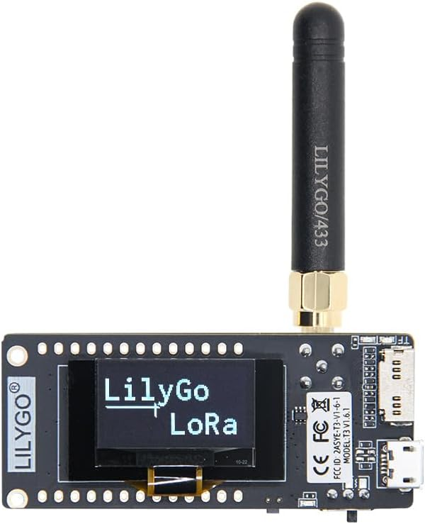
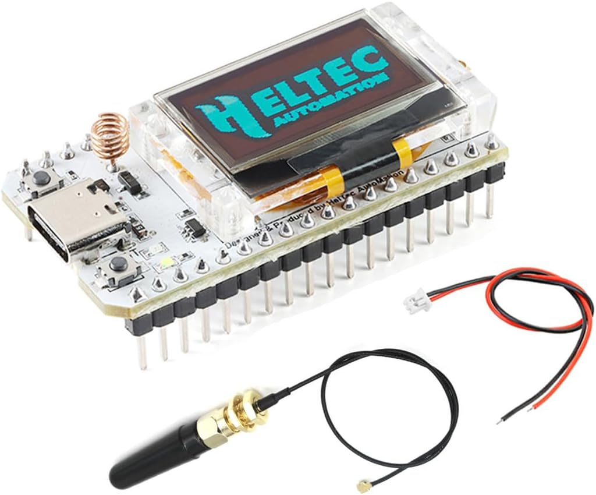

# esphome-quietcool

ESPHome firmware that controls **QuietCool whole-house / gable attic fans** over
their native 433.92 MHz radio link, from Home Assistant — no cloud, no OEM hub,
no BLE. The RF protocol was **reverse-engineered from the OEM handheld remote's
firmware** (an STM32 dump + SDR captures); this repository is an independent,
clean-room implementation of what that analysis found.

> QuietCool's wireless wall/handheld controls speak a proprietary 2-FSK protocol
> that ordinary 433 MHz gear (Sonoff RF Bridge, OOK/ASK bridges) can't reproduce.
> This project drives the fan directly with a Semtech LoRa transceiver in raw FSK
> packet mode.

**The product is the C++ external component** under
[`components/quietcool/`](components/quietcool) — a host-tested,
sanitizer-gated RF confirmation core — plus the `quietcool-cpp-*.yaml`
configurations at the repository root that wire it to real boards. An earlier
all-YAML implementation is preserved as a frozen legacy track under
[`legacy/`](legacy/).

## Where to buy

All you need is one of these two off-the-shelf ESP32 LoRa boards (each is a
complete kit: ESP32 + 433 MHz radio + OLED + antenna):

| [LilyGO TTGO LoRa32 V2.1 (433 MHz)](https://amzn.to/4vBvqOU) | [HiLetgo ESP32 LoRa V3 (SX1262)](https://amzn.to/4wagWqi) |
| :---: | :---: |
| [](https://amzn.to/4vBvqOU) | [](https://amzn.to/4wagWqi) |
| **[Buy on Amazon](https://amzn.to/4vBvqOU)** — the reference board this project was built and **verified working on real fans** (SX1278, `quietcool-cpp-lora32.yaml`) | **[Buy on Amazon](https://amzn.to/4wagWqi)** — ⚠️ **not yet confirmed working**: the SX1262/ESP32-S3 port (`legacy/quietcool-lora-v3.yaml`) compiles but hasn't been tested on real hardware. Choose the LilyGO unless you want to help with bring-up |

<sub>Disclosure: as an Amazon Associate (store `joyfulhousegi-20`) the maintainers
may earn from qualifying purchases through the links above. They cost you nothing
extra.</sub>

## Supported hardware

| Board | Radio | MCU | Config | Status |
| --- | --- | --- | --- | --- |
| LilyGO TTGO LoRa32 **V2.1** (433 MHz) | SX1278 (SX127x) | ESP32 | `quietcool-cpp-lora32.yaml` (C++, **primary**) | Running on real fans |
| Heltec / HiLetgo ESP32 LoRa **V3** (433–510 MHz) | SX1262 (SX126x) | ESP32-S3 | `legacy/quietcool-lora-v3.yaml` (legacy YAML) | Builds; awaiting hardware bring-up |

The maintained build is the **C++ core** (`quietcool-cpp-lora32.yaml`), which
keeps the RF confirmation state machine in the tested C++ component under
`components/quietcool/`. The V3/SX1262 board has no deployable C++ config yet
(`quietcool-cpp-example-sx126x.yaml` is a compile-only reference), so V3 stays
on the [legacy YAML track](#legacy-yaml-track-frozen) for now.

The V3 port reproduces the identical 2-FSK profile on the SX1262 (ESPHome's
`sx126x` component exposes the same bitrate/deviation/sync/preamble/variable-length
knobs). CI validates and compiles the V3 config on every change. That is a
build gate, not evidence of on-air behavior: the V3 has not been run on real
hardware yet — a few pins (status-LED polarity, the VBAT ADC divider, and the
RX filter bandwidth) are noted inline as `PIN CONFIDENCE` items to confirm on
first bring-up. See [docs/hardware.md](docs/hardware.md).

Both need a **433 MHz antenna** connected before transmitting.

## Quick start (C++ build)

Four `quietcool-cpp-*.yaml` configs live at the repository root:

| File | Use it when |
| --- | --- |
| `quietcool-cpp-example.yaml` | **Canonical starting point** — the minimal config-and-wiring-only shape of the C++ build (compile-only: no network/secrets) |
| `quietcool-cpp-lora32.yaml` | **Full-featured deployable reference** for the TTGO LoRa32 V2.1 — network, OLED, HA entities. Flash this |
| `quietcool-cpp-example-sx126x.yaml` | Minimal compile-only reference for SX126x boards (Heltec V3) |
| `quietcool-cpp-diag.yaml` | Loop-stack diagnostic harness (packages the primary config) |

```bash
# 1. Install ESPHome (uv recommended)
uv venv .venv && uv pip install --python .venv/bin/python esphome

# 2. Provide secrets
cp secrets.yaml.example secrets.yaml   # then edit

# 3. Validate, build, flash (USB first time, OTA after)
.venv/bin/esphome run quietcool-cpp-lora32.yaml
```

Then adopt the device in Home Assistant (ESPHome integration) and teach it your
fan via [Learn mode](#learn-mode--porting-to-your-own-fan). The full
step-by-step walkthrough — flashing, HA adoption, pairing, display setup,
troubleshooting — is in **[INSTALL.md](INSTALL.md)**.

<!-- ci-coverage:begin -->
**What CI gates.** Every push and pull request runs the host C++ suites (plain,
adapter, and ASan/UBSan) and `esphome config` on every checked-in
configuration. It then compiles `quietcool-cpp-example.yaml`,
`quietcool-cpp-example-sx126x.yaml`, `legacy/quietcool-lora32.yaml`, and
`legacy/quietcool-lora-v3.yaml`. CI does **not compile**
`quietcool-cpp-lora32.yaml` or `quietcool-cpp-diag.yaml`: their display and
entity lambdas are built only by the pre-PR checklist in
[CONTRIBUTING.md](CONTRIBUTING.md), so compile locally before you flash.
<!-- ci-coverage:end -->

## Features

- **Closed-loop confirmation** — after a new command the controller sends the
  OEM's own `66 66` status query, decodes the fan's reply, and confirms that
  the query-correlated reported state matches the request. The custom fan
  control path does not publish a request
  as observed state. Because ESPHome's native Fan API cannot represent
  “unknown” and exposes its raw Off/Low defaults when HA first subscribes,
  `Fan State Known` records whether that entity state is physical evidence;
  the atomic `Fan Confirmed Off` diagnostic is the recommended HA interlock
  input. Every equivalent request joins its active transaction without
  transmitting again or resetting its fixed, spaced attempt budget. After a
  physical OEM remote is used, the controller waits 3 s for the exchange to
  finish and then sends one automatic status query, so HA authority recovers
  in seconds instead of waiting for a manual Refresh; while authority is lost
  the OLED suffixes the state word with `?`.
- **Direct RF fan control** — Off / Low / Medium / High (where supported by
  the fan model) on the fan entity, transmitted as the exact OEM frames. On the
  C++ build timer modes are set from the OEM remote (the legacy YAML build
  additionally exposes a speed-aware timer *select* in Home Assistant covering
  the fan's full 1 / 2 / 4 / 8 / 12-hour range). Either way, `Timer State Known`
  and the read-only `Timer Remaining` sensor present a countdown only when it is
  backed by correlated evidence — never a guessed `None` — so an unresolved
  command cannot present stale timer metadata as confirmed.
- **Learn mode** — capture your fan's 4-byte sender ID from its OEM remote (two
  presses on the YAML build, three on the C++ core build). No packet sniffing or
  firmware extraction needed to onboard; the ID is persisted in NVS and survives
  reboots and OTA. See [Learn mode](#learn-mode--porting-to-your-own-fan).
- **Home Assistant native API** — a proper `fan` entity plus diagnostics: the
  `*_Known` evidence flags, atomic `Fan Confirmed Off`, `Command Confirmation
  Status`, `Fan Evidence Source`, a `Controller Fault` `problem` sensor that
  flags a degraded (reboot-required) controller, and battery voltage/level.
- **Bi-directional diagnostics, query-confirmed state** — the controller also
  *listens* and records strictly validated OEM traffic without echoing it over
  RF. A passively heard OEM command cancels conflicting local work and is
  visible in RF diagnostics, but it never mutates the safety-facing fan entity:
  hearing a command is not proof that the receiver acted. Only consensus from
  this controller's locally anchored query can publish physical state.
- **On-device OLED** — animated fan icon, timer countdown, three
  HA-relayed temperatures (indoor / outdoor / attic) with semantic icons, and a
  WiFi / API / battery status row. Temperature sources are configurable from the
  HA UI, not hard-coded.
- **Safety-first** — never sends a fan *command* unbidden: commands come only
  from an explicit press or HA request, plus the bounded confirmation query and
  spaced re-fires they arm. (It does send non-energizing `66 66` status queries
  on its own — after boot/OTA and a few seconds after hearing the OEM remote —
  which cannot start the fan.) Multi-model adversarially reviewed.
- **Multi-board & multi-fan** — two board configs (SX1278 / SX1262) kept
  behaviorally identical; a second fan on the same board type can be a thin
  per-device wrapper overriding only the device-identity substitutions.

### How the closed loop works

The fan answers the OEM `66 66` status query with a six-byte state report
(`CB` + your remote's ID suffix + a duplicated state byte). This firmware uses
the exact validation rules recovered from the OEM remote's STM32: state is
compared on the lower six bits, any zero-duration report confirms Off
regardless of remembered speed, and bits 7:6 carry the fan's speed-capability
metadata. After each command burst the controller queries, requires **response
consensus** (repeated agreeing reports inside a bounded listen window — with a
deliberately narrow recovery tier for weak-link bit errors, since the fan has
no CRC), and then either confirms and stops, or lets the pre-existing spaced
re-fire backstop continue up to its fixed attempt budget. Every outcome —
`confirmed`, `mismatch`, `no consensus`, `FAILED`, or `superseded by OEM
remote` — is published to Home Assistant, and a physical OEM remote press
always takes priority over pending automatic work.

The full engineering detail lives in the docs, not here:

- the query/response timing model, transaction/consensus rules, Off-variant
  semantics, timer state-knowledge contract, and the bounded TX queue —
  [docs/protocol.md](docs/protocol.md) (see “Query timing and closed-loop
  control” and “State-knowledge boundary”);
- the 2026-07-19 production Off-flapping RCA and the live validation record —
  [docs/protocol.md](docs/protocol.md#2026-07-19-production-rca) and
  [docs/deployment.md](docs/deployment.md);
- the recovered OEM firmware evidence behind all of it —
  [docs/firmware-analysis.md](docs/firmware-analysis.md).

> ⚠️ **Safety automations MUST gate on `Fan Confirmed Off` (or
> `Fan State Known`), never on the bare `fan.*` entity.** This is a hard
> requirement, not a preference: ESPHome's Fan API cannot represent
> "unknown", and on every boot, OTA update, crash recovery, or API
> reconnect Home Assistant re-reads the entity's raw compiled default
> (Off/Low) the moment it subscribes — *before* any query has confirmed
> anything. An automation keyed to `fan.state` will therefore see a
> spurious "Off" edge on every reboot even though this firmware never
> *publishes* optimistically — the API layer reports raw fields on
> subscribe, outside any publish discipline. `Fan Confirmed Off` is
> immune: it is false until authoritative query consensus proves Off.

## Documentation

- [INSTALL.md](INSTALL.md) — step-by-step install, pairing, and troubleshooting
- [docs/protocol.md](docs/protocol.md) — RF profile, frame format, command byte,
  closed-loop transaction rules, 2026-07-19 RCA
- [docs/firmware-analysis.md](docs/firmware-analysis.md) — the reverse-engineering:
  memory map, register config, command-byte and response-parser disassembly,
  per-unit ID mechanism
- [docs/hardware.md](docs/hardware.md) — boards, wiring, antenna, buying links
- [docs/display.md](docs/display.md) — OLED layout, icon language, preview renderer
- [docs/deployment.md](docs/deployment.md) — multi-device pattern + a real 2-fan install
- [legacy/README.md](legacy/README.md) — the frozen all-YAML track

## Legacy YAML track (frozen)

Before the C++ core, the whole confirmation state machine lived in YAML
lambdas. That implementation was **frozen on 2026-07-21** and moved to
[`legacy/`](legacy/): `legacy/quietcool-lora32.yaml` (TTGO / SX1278,
superseded by the C++ build) and `legacy/quietcool-lora-v3.yaml` (Heltec V3 /
SX1262 — still the only deployable config for that board). Both remain
buildable, CI-validated, and covered by the Python regression suite, and they
still use the supported `components/quietcool_legacy_yaml` fan platform — but
no new behavior lands there. See [legacy/README.md](legacy/README.md).

## Repository layout

```
INSTALL.md                        # step-by-step setup guide
quietcool-cpp-lora32.yaml         # TTGO LoRa32 V2.1 / SX1278 — C++ build (PRIMARY, flash this)
quietcool-cpp-example.yaml        # minimal C++ starting point (compile-only)
quietcool-cpp-example-sx126x.yaml # minimal C++ reference for SX126x boards (compile-only)
quietcool-cpp-diag.yaml           # C++ loop-stack diagnostic harness
components/quietcool/             # C++ confirmation core (the product)
components/quietcool_legacy_yaml/ # fan-entity platform used by the legacy track
legacy/                           # frozen all-YAML build track (see legacy/README.md)
secrets.yaml.example              # copy to secrets.yaml (gitignored)
tests/                            # host C++ suites + config regression tests
tools/                            # display renderer + fan-frame generator
fonts/ images/                    # OLED assets (MDI webfont, fan bitmaps)
docs/                             # protocol, firmware analysis, hardware, display
```

## Safety

A whole-house fan moves a lot of air. Before energizing one: open enough windows
for makeup air, confirm combustion appliances can't backdraft, and keep a working
OEM control as a fallback. The checked-in templates preserve a strict causal
invariant: RF only ever originates from an explicit button press or Home
Assistant command, plus the bounded follow-ups those arm — the confirmation
query and the spaced re-fire attempts, both volatile and hard-limited. No
*command* transmits at boot, after OTA, on reconnect, from restored state, or
from a received frame. The radio does send bounded, **non-energizing** `66 66`
status queries on its own — a provisioned unit sends one shortly after boot (and
after an OTA reboot), and one a few seconds after it hears an OEM-remote press,
to re-establish confirmed state — none of which can start the fan. Repeated
equivalent Off requests are transaction-idempotent:
they cannot transmit, replenish attempts, clear confirmation evidence, or
extend the terminal deadline. A heard OEM-remote press cancels all pending
automatic work.

Home Assistant safety automations should use the single `Fan Confirmed Off`
binary sensor when they need an Off assertion. On initial API subscription the
native fan entity necessarily exposes the Fan API's raw Off/Low defaults even
though no RF observation exists; joining that entity with `Fan State Known` in
HA is not atomic. `Fan State Known` remains useful as a diagnostic authority
flag for the fan entity, and timer consumers must require `Timer State Known`.
None of these RF-derived values is an eternal physical sensor: if every frame
from a later OEM press is missed, the last confirmation can become stale. Use
an explicit Refresh or a separate motor/airflow sensor where freshness is
safety-critical.


## Security

The OEM 433 MHz protocol is unauthenticated, so a transmitter within RF range
can influence both the fan and the state reported to Home Assistant. What that
means for deployment — and what "confirmed" state does and does not guarantee —
is written up in [SECURITY.md](SECURITY.md).


## Learn mode / porting to your own fan

Every QuietCool OEM sender ID is four bytes beginning with `CB`; the RF
profile and command format are universal. This firmware can therefore learn a
fan's ID from its OEM remote through the existing receive path.

> **Two builds — follow the one you flashed.** The **default build is now the
> C++ core** (`quietcool-cpp-lora32.yaml`, which compiles `components/quietcool/`);
> pair it with [Pairing on the C++ core build](#pairing-on-the-c-core-build)
> below. The original **legacy YAML build** (`legacy/quietcool-lora32.yaml`)
> pairs differently — two presses and an on-OLED prompt — and is documented
> under the "legacy YAML build" headings that follow. As of this writing the
> reference TTGO unit runs the C++ build; a second unit remains on the legacy
> YAML build pending cutover. Matching the wrong procedure to your firmware is
> the common mistake, so confirm which you flashed.

### First-boot flow (legacy YAML build)

1. Before compiling, change the top-level substitution in
   `legacy/quietcool-lora32.yaml` to:

   ```yaml
   substitutions:
     quietcool_sender_id: "0x00000000"
   ```

   This is deliberately a normal substitution, not a `!secret`, so the
   portable configuration has no extra secrets-file dependency. The checked-in
   default is `0x00000000` — the firmware ships in learn mode and captures
   your fan's ID on first boot.
2. Flash normally. When the persisted ID is zero, boot enters auto-learn and
   the OLED shows `LEARN / REMOTE X2`. Auto-learn stays armed - re-arming its
   120-second listening window as needed - for up to **15 minutes after
   power-on**, on the assumption that the installer is physically present at
   first power-on. Past that ceiling it disarms fully and the OLED returns to
   its normal (unprovisioned/OFF) layout; TX still refuses while unprovisioned
   regardless. See "Manual re-learn and forget" below to re-arm afterward.
3. Press a command on the OEM remote, wait more than 600 ms, then press the
   remote again within 60 seconds. Learn on any build can only bind a sender it
   actually hears, so keep the target fan's remote transmitting while the
   window is open — if another QuietCool within RF range is the only sender
   heard, it is the one that binds. Two separate button presses are the
   required workflow: only a real state-command frame (a speed/duration
   button press) can start or confirm a candidate, so the OEM's three 45 ms
   repeats within one press cannot confirm themselves, and the passive `66
   66` wake/status query can never complete a learn on its own - a
   requirement that also blocks a parked, unprovisioned unit from picking up
   a neighboring installation's ID from overheard query/command cross-talk.
4. On acceptance the OLED briefly shows `LEARNED / ID SAVED`, the
   `Remote Sender ID` Home Assistant text sensor publishes the captured
   four-byte ID (always beginning `CB`), and it is force-committed to NVS.
   Until an ID is set,
   `tx_burst` logs an error and refuses to transmit or increment `TX Count`.

Only a six-byte, `CB`-prefixed frame carrying a valid speed/duration
state-command (matching command bytes, a real speed nibble, a real duration
nibble) can become a candidate; the `66 66` query is rejected even from the
owner's own remote. A second valid frame must carry the same ID more than 600
ms but less than 60 seconds after the first. A different valid sender restarts
the two-frame count, which prevents a nearby neighbor's one-off remote press
from completing a candidate started by another sender. Learn frames are
consumed by the RX and storage path and never publish fan state or reach any
TX action.

### Manual re-learn and forget (legacy YAML build)

- Press the Home Assistant `Learn Remote ID` button (in the device's
  Configuration section, disabled by default — enable the entity first), or
  hold the board's PRG
  button for 5-10 seconds. This opens a 120-second manual window and leaves the
  currently stored ID intact unless a new candidate is confirmed. The existing
  1-5 second PRG Off gesture ends at 4999 ms, so the gestures do not overlap.
  This is the required way to re-arm learning once the first-boot 15-minute
  window has elapsed.
- Press `Forget Remote ID` to write zero to NVS immediately, publish `unset`,
  and re-enter auto-learn (with its own fresh 15-minute ceiling, since Forget
  is itself a deliberate local/HA action) until a replacement remote is
  confirmed. Forget also durably suppresses the compiled default: even on a
  build compiled with a nonzero `quietcool_sender_id`, on_boot will **not**
  silently reseed that value on the next reboot, so a Forget stays forgotten
  across reboot and OTA. A later successful learn clears the suppression.
  Third-party builds should still keep the substitution at `0x00000000`.

`learned_sender_id` uses ESPHome's restored globals storage. A learned ID
survives ordinary reboot, OTA, and subsequent firmware updates that retain the
same global. A full flash/NVS erase removes it (along with the Forget
suppression flag); after such an erase, boot either applies the nonzero
compile-time seed or starts auto-learn when the seed is zero.

Acceptance requires two matching bursts from the same `CB`-prefixed sender more
than 600 ms apart — a **two-burst neighbor guard** so a single stray frame from a
neighbor's fan on the shared band can't provision your controller. While a learn
window is armed the OLED shows `LEARN / REMOTE X2`, then briefly `LEARNED / ID
SAVED` on success (previewed in `docs/display-previews/learn-active.png` and
`docs/display-previews/learn-confirmed.png`).

### Pairing on the C++ core build

This is the **default build**, flashed from `quietcool-cpp-lora32.yaml`. The C++
core reimplements the learn logic with a higher evidence bar, so its pairing
procedure differs from the legacy YAML build above in five ways:

- **Three independent sightings, not two.** The controller binds a remote only
  after it has heard the *same* `CB`-prefixed command frame three separate
  times, each sighting at least 600 ms after the previous one it counted, all
  within a 60-second window. A single OEM transmission is a burst of repeated
  frames a few milliseconds apart, and that whole burst counts as **one**
  sighting no matter how many frames it carries. In practice, **press the target
  fan's remote about three times, roughly a second apart** — pressing twice is
  not enough, and leaves the controller waiting with nothing saved and no error.
- **A second remote aborts the attempt.** If a different `CB` sender is heard
  during the window — a neighbor's fan, or the other unit in your own house —
  the controller abandons the entire window and keeps whatever ID was already
  bound, rather than risk binding the wrong fan. Silence the other unit and
  retry.
- **Re-learning a provisioned unit is deliberately two steps: Forget, then
  Learn.** While a sender ID is bound — whether learned over the air or
  compiled in via `quietcool_sender_id` — pressing `Learn Remote ID` is
  **refused**: no learn window opens, the binding is untouched, and nothing is
  written to flash. The refusal is visible on the `Command Confirmation
  Status` sensor (`refused`) and in the device log
  (`reason=already_provisioned`). Press `Forget Remote ID` first, then `Learn
  Remote ID`. Previously a single accidental Learn press on a
  correctly-provisioned unit opened a window in which its binding could be
  replaced by whatever single fan happened to be transmitting; requiring the
  explicit Forget makes re-binding a deliberate act. Fresh (unprovisioned)
  devices are unaffected — Learn works immediately.
- **No OLED learn prompt.** This build renders no `LEARN` / `REMOTE X2` screen.
  Watch pairing progress in the device logs and on the `Learn Remote ID` button
  entity instead.
- **Trigger the intended fan while learning — this is mandatory, not a tip.**
  Start Learn and then immediately operate the target fan's own remote, so that
  fan is guaranteed to be among the senders heard — its ~1.2 s status
  self-reports then help reach the three-sighting bar. The abort-on-second-sender
  guard can only protect you when the intended fan is among the senders heard:
  if the target stays silent for the whole window and a lone foreign fan on the
  shared band is the only sender heard, the guard has nothing to disambiguate
  against and the controller **will bind the foreign fan** (issue #17). The
  realistic exposure is narrow — a unit already provisioned (compiled seed or
  earlier learn) never learns on its own, so the exposed case is first-time
  pairing of an unprovisioned unit within RF range of another active QuietCool —
  but that is exactly the situation a new installation is in, so keep the target
  fan transmitting for the whole window.


## Provenance & license

This is an independent reverse-engineering effort. The 433 MHz carrier and the
2-FSK nature were established from SDR captures; the exact register profile,
frame format, sender-ID mechanism, and command-byte structure were recovered by
dumping and disassembling the OEM remote's STM32 firmware (see
[docs/firmware-analysis.md](docs/firmware-analysis.md)). An early community
proof-of-concept ([ccrome/quiet-cool-rf-remote](https://github.com/ccrome/quiet-cool-rf-remote))
pointed at the general approach but was not used in the working implementation.

Code, tooling, and docs are MIT-licensed (see [LICENSE](LICENSE)). The OEM
firmware itself is not redistributed — only independently derived facts about the
protocol are documented here. "QuietCool" is a trademark of its owner; this
project is not affiliated with or endorsed by QuietCool.
